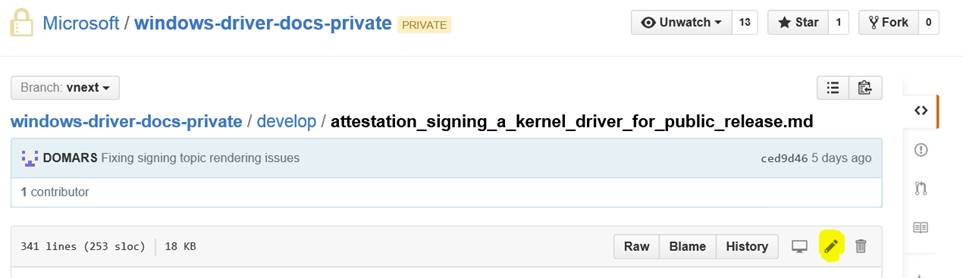
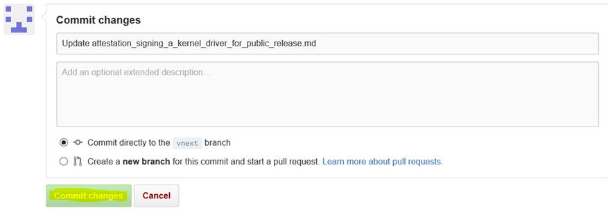
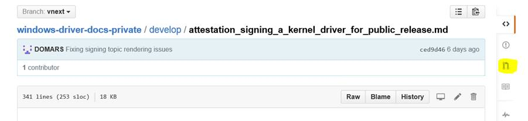
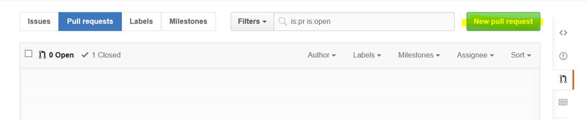
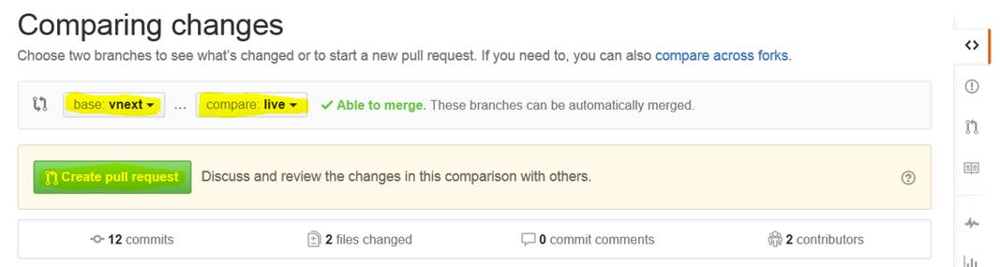

Thank you for your interest in updating a topic using our new [GitHub] (https://help.github.com/) and [Markdown] (https://guides.github.com/features/mastering-markdown/), open docs system. This is a pilot process, where we can work with others to co-author MSDN content using open doc tools.

### Setting up your GitHub Account

If you don't have a Microsoft associated GitHub ID, you will need to create a GitHub account, here are the directions to do that.

1. First step is to get a github login:

 [https://opensourcehub.microsoft.com/articles/how-to-get-a-github-id] (https://opensourcehub.microsoft.com/articles/how-to-get-a-github-id)

2. Then you need to associate that GitHub account as Microsoft account:

 [https://opensourcehub.microsoft.com/articles/how-to-join-microsoft-github-org-self-service] (https://opensourcehub.microsoft.com/articles/how-to-join-microsoft-github-org-self-service)

3. When that is done, you can email the docs team contact your GitHub account and we will grant permissions for it to the driver docs pilot project.

### Navigate to the Proper Branch

After permissions are granted, you can make changes in the “vnext” branch using a browser. Contact the docs team for a link to the topic you will be working on. The example driver signing topic shown in the screen shots, is a live topic, so please refrain from experimenting with it.

[https://github.com/Microsoft/windows-driver-docs-private/blob/vnext/develop/] (https://github.com/Microsoft/windows-driver-docs-private/blob/vnext/develop/)

### Making Edits

Click on the pencil to edit the topic:

You can make edits in the browser based editor. 
For fancy formatting such as bullets, markdown is used. Here is one link that describes the available formatting:
[https://guides.github.com/features/mastering-markdown/] (https://guides.github.com/features/mastering-markdown/)

### Committing the Changes

When you are done, click on the commit changes button at the bottom of the page.

### Create a Pull Request

After the changes are committed, you need to create a pull request to move the changes to the live branch that is published to MSDN. To create a pull request:

1. On the GitHub right sidebar, click the icon for pull requests on the right side of the screen.

 

2. Then click on the *New pull request* button.

 

3. In the pull down fields select these values.

 base: *vnext*

 compare: *master*

4. Click on the *Create pull request* button.

 

The docs team will be able to double check the changes that you make and push them live to MSDN.

